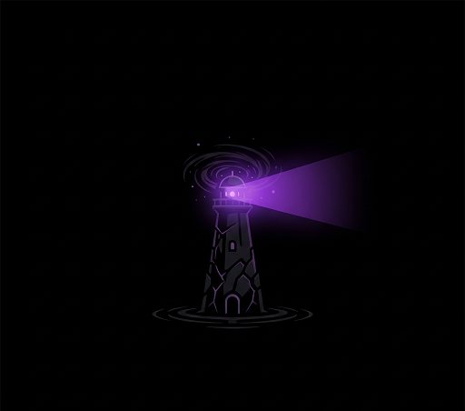
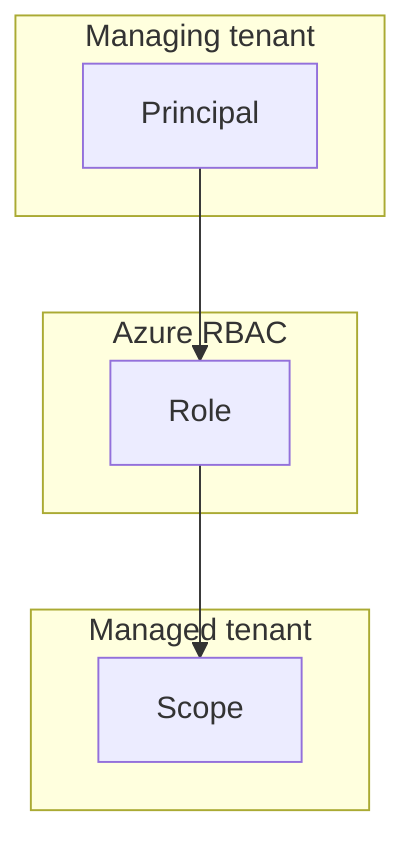

# DarkLighthouse




PowerShell module for discovering cross-tenant access via Azure Lighthouse delegated resource management. 
The idea is to quickly map out what delegated access a user or SPN you control has access to, or to help you set up persistence by creating and deploying Azure Lighthouse templates on the Resource Group and Subscription scopes for you. 

Could you do this with Powershell and the GUI much faster? 

Probably. 

***But where's the fun in that, right?***

> [!CAUTION]
> **Disclaimer**
>
> **This tool is intended for authorized security assessments and legitimate administrative purposes only.** 
Users must have proper authorization to audit cross-tenant access in their environments. Unauthorized access to systems, networks, or data is illegal. The authors assume no liability for misuse of this tool.
> 
> By downloading, installing, or using this tool, you acknowledge that you have read, understood, and agree to these terms.

## The basics of Azure Lighthouse

You can go read [this blog](https://www.infernux.no/AzureLighthouse-101/) for the breakdown, but a TL;DR is as follows:

Azure Lighthouse is a delegated management tool that allows you to configure access from one Azure tenant to another. It requires you to define a **principal (user/group/spn)** in a **managing tenant A** that should have **access to a role on a scope (RG/SUB) in a managed tenant B**.



This definition is deployed as a template in tenant B, giving the principal standing access to tenant B from tenant A. There are some quirks here, like the option to make the authorization (which is what an assignment is called) eligible - then it will show up in tenant A under PIM and Azure Roles. 
You can also have eligible access into a PIM group in tenant A, and then PIM group has the standing access to tenant B. This tool only checks active assignments, so activate anything before running it. 

## Quick Start

```powershell
# 1. Install and import
Install-Module Az.Accounts, Az.Resources -Scope CurrentUser
Import-Module .\DarkLighthouse.psd1

# 2. Launch interactive wizard (easiest)
Invoke-DarkLighthouse

# 3. Or run direct discovery
$output = Invoke-DarkLighthouse -Username "user@contoso.com" -TenantId "00000000-0000-0000-0000-000000000000"
```

Output should look something like this:
```
$output

TenantId           : 00000000-0000-0000-0000-000000000000
AuthenticationType : Interactive
DiscoveryDate      : MM/dd/yyyy HH:mm:ss
LighthouseAccess   : {@{Scope=Subscription; Target=YourSubscription; OfferName=ManagedServices; Description=;
                     ManagingTenant=00000000-0000-0000-0000-000000000001; TargetTenant=00000000-0000-0000-0000-000000000000; Roles=Reader;
                     CrossTenant=True; SubscriptionId=00000000-0000-0000-0000-000000000000; SubscriptionName=YourSubscription; AssignmentId=/subscriptions/00000000-0000-0000-0000-000000000000/providers/Microsoft.ManagedServices/registrationAssignments/00000000-0000-0000-0000-000000000002; DiscoveredAt=MM/dd/yyyy HH:mm:ss}}
Warnings           : {}
```

## Prerequisites

This module requires the following PowerShell modules:

**Required for Lighthouse Discovery:**
- `Az.Accounts` (v2.0.0+)
- `Az.Resources` (v6.0.0+)

## Installation

1. Install required modules:
```powershell
# Required for Lighthouse discovery
Install-Module Az.Accounts, Az.Resources -Scope CurrentUser
```

2. Import the module:
```powershell
Import-Module .\DarkLighthouse.psd1
```

## Usage

### Wizard Mode (Recommended for First Time Use)

The easiest way to use DarkLighthouse is through the interactive wizard:

```powershell
# Launch wizard mode (no parameters needed)
Invoke-DarkLighthouse

# Or explicitly
Invoke-DarkLighthouse -Wizard
```

1. **Check Azure Lighthouse delegations only** - Discover delegated access across tenants
2. **Create Lighthouse delegation template** - Generate ARM templates for new delegations
3. **Exit**

Each option prompts for required information step-by-step.

### Important Notes

**PIM Eligible Access**: Before running discovery:
- Activate any **eligible Lighthouse delegations** in Azure Portal → PIM → Azure Resources
- Activate any **eligible group memberships** if those groups have Lighthouse access
- This tool only discovers ACTIVE delegations, not eligible assignments
- You will be prompted to confirm activation before discovery starts

### Command-Line Usage

#### Lighthouse-Only Discovery (Default)
```powershell
Invoke-DarkLighthouse -Username "admin@contoso.com" -TenantId "tenant-id"
```

#### Service Principal Authentication
```powershell
# Service principals can only check Lighthouse (B2B requires user context)
$secret = ConvertTo-SecureString "your-client-secret" -AsPlainText -Force
Invoke-DarkLighthouse -ApplicationId "00000000-0000-0000-0000-000000000000" -ClientSecret $secret -TenantId "00000000-0000-0000-0000-000000000000"
```

## Output

The command displays formatted output with only relevant information (blank and unknown values are automatically filtered):

### Discovery Mode Output Example

```powershell
Invoke-DarkLighthouse -Username "admin@contoso.com" -TenantId "tenant-id"

# Output:
Azure Lighthouse Delegations:

Target             : Your Subscription
TargetTenant       : 00000000-0000-0000-0000-000000000000
SubscriptionId     : 00000000-0000-0000-0000-000000000001
SubscriptionName   : Your Subscription
AssignmentId       : /subscriptions/.../registrationAssignments/00000000-0000-0000-0000-000000000002
DiscoveredAt       : MM/dd/yyyy HH:mm:ss

Discovery Summary:
  Lighthouse Delegations: 1
```

### Lighthouse Access Properties

The module uses `Get-AzManagedServicesAssignment` and `Get-AzManagedServicesDefinition` cmdlets to discover delegations. Each delegation may include:

- **Target**: Subscription or resource group name
- **TargetTenant**: Target tenant ID
- **SubscriptionId**: Azure subscription ID
- **SubscriptionName**: Subscription display name
- **ResourceGroup**: Resource group name (for RG-scoped delegations)
- **AssignmentId**: Full assignment resource ID
- **Scope**: Subscription or ResourceGroup
- **OfferName**: Delegation offer name (if available)
- **ManagingTenant**: Managing tenant ID (if available)
- **Roles**: Assigned role definitions (if available)
- **DiscoveredAt**: Discovery timestamp

Note: Some fields may not appear if the delegation definition details cannot be retrieved.

## Creating Lighthouse Delegations

The module includes functionality to create and deploy Azure Lighthouse delegation templates. When we refer to `PrincipalId` this is the `ObjectId` of the resource in Entra ID.

### Template-Only Mode (No Authentication Required)

Create template files without authentication or deployment using `-TemplateOnly`:

```powershell
# Generate template files only
Invoke-DarkLighthouse -TemplateOnly `
    -PrincipalId "12345678-1234-1234-1234-123456789012" `
    -Scope Subscription `
    -Role Reader `
    -ManagingTenantId "your-msp-tenant-id" `
    -TargetTenantId "customer-tenant-id" `
    -SubscriptionId "customer-subscription-id" `
    -OfferName "Contoso Managed Services" `
    -TemplateOutPath "C:\Templates"

# This creates two files:
# - Lighthouse-<OfferName>.json (ARM template)
# - Lighthouse-<OfferName>.parameters.json (parameters file)
```

### AddPersistence Mode (With Deployment)

Create templates with optional immediate deployment using `-AddPersistence`:

### Supported Role Names

Instead of GUIDs, use human-readable role names:

| Role Name | Description |
|-----------|-------------|
| `Reader` | View all resources |
| `Contributor` | Manage resources (no RBAC changes) |
| `Owner` | Full access including RBAC |
| `UserAccessAdministrator` | Manage user access to Azure resources |
| `VirtualMachineContributor` | Manage virtual machines |
| `StorageBlobDataContributor` | Read, write, and delete Azure Storage blobs |
| `StorageBlobDataReader` | Read Azure Storage blobs |
| `KeyVaultSecretsUser` | Read Key Vault secrets |
| `MonitoringContributor` | Manage monitoring resources |
| `LogAnalyticsContributor` | Manage Log Analytics |
| `SecurityAdmin` | View and update security policies |
| `NetworkContributor` | Manage networks |

You can also provide a custom role definition GUID if needed.

### Create a Subscription-Level Delegation

This example only creates the required template files, which we can onboard by deploying a custom template at https://portal.azure.com/#create/Microsoft.Template and supplying our template and parameter file.

```powershell
# Create template (saves parameter file, does not deploy)
Invoke-DarkLighthouse -AddPersistence `
    -PrincipalId "12345678-1234-1234-1234-123456789012" `
    -Scope Subscription `
    -Role Reader `
    -ManagingTenantId "your-msp-tenant-id" `
    -TargetTenantId "customer-tenant-id" `
    -SubscriptionId "customer-subscription-id" `
    -OfferName "Contoso Managed Services" `
    -OfferDescription "24/7 monitoring and support" `
    -PrincipalDisplayName "Contoso Support Team"
```

### Create a Resource Group-Level Delegation

This example uses the -Deploy tag, if you have access in the target tenant it will automatically attempt to deploy the template for you.

```powershell
# Create and deploy immediately
Invoke-DarkLighthouse -AddPersistence `
    -PrincipalId "12345678-1234-1234-1234-123456789012" `
    -Scope ResourceGroup `
    -ResourceGroupName "rg-example" `
    -Role Contributor `
    -ManagingTenantId "your-msp-tenant-id" `
    -TargetTenantId "customer-tenant-id" `
    -SubscriptionId "customer-subscription-id" `
    -OfferName "Contoso RG Management" `
    -Deploy
```

You will be prompted for an interactive sign-in and the output looks something like this:

```
Deploying Lighthouse template to target tenant...
WARNING: This deployment must be executed by a user in the target tenant (13371337-1337-1337-1337-13371337) with Owner permissions.
Connecting to target tenant...
Please select the account you want to login with.

Retrieving subscriptions for the selection...
Deploying to subscription 13371337-1337-1337-1337-13371337...
VERBOSE:
VERBOSE: 13:07:11 - Template is valid.
VERBOSE: 13:07:14 - Create template deployment 'Lighthouse-BuiltinAzureLighthouse-20251207130641'
VERBOSE: 13:07:14 - Checking deployment status in 5 seconds
VERBOSE: 13:07:19 - Resource Microsoft.ManagedServices/registrationDefinitions '13371337-1337-1337-1337-13371337' provisioning status is succeeded
VERBOSE: 13:07:20 - Checking deployment status in 5 seconds
VERBOSE: 13:07:26 - Resource Microsoft.Resources/deployments 'rgAssignment' provisioning status is running
VERBOSE: 13:07:26 - Resource Microsoft.ManagedServices/registrationAssignments '13371337-1337-1337-1337-13371337' provisioning status is running
VERBOSE: 13:07:26 - Checking deployment status in 12 seconds
VERBOSE: 13:07:40 - Checking deployment status in 13 seconds
VERBOSE: 13:07:55 - Checking deployment status in 14 seconds
VERBOSE: 13:08:11 - Resource Microsoft.Resources/deployments 'rgAssignment' provisioning status is succeeded
VERBOSE: 13:08:11 - Resource Microsoft.ManagedServices/registrationAssignments '13371337-1337-1337-1337-13371337' provisioning status is succeeded
Deployment successful!

DeploymentName       : Lighthouse-BuiltinAzureLighthouse-20251207130641
Scope                : ResourceGroup
TemplateFile         : .\Lighthouse-BuiltinAzureLighthouse-20251207130641.json
ParameterFile        : .\Lighthouse-BuiltinAzureLighthouse-20251207130641.parameters.json
TargetSubscriptionId : 1337-1337-1337-1337-1337
TargetTenantId       : 1337-1337-1337-1337-13371337
ResourceGroupName    : test
Deployed             : True
```

## Known errors

1. Some `Az`-modules might output errors about breaking changes. Disable this by running `Update-AzConfig -DisplayBreakingChangeWarning $false`.

